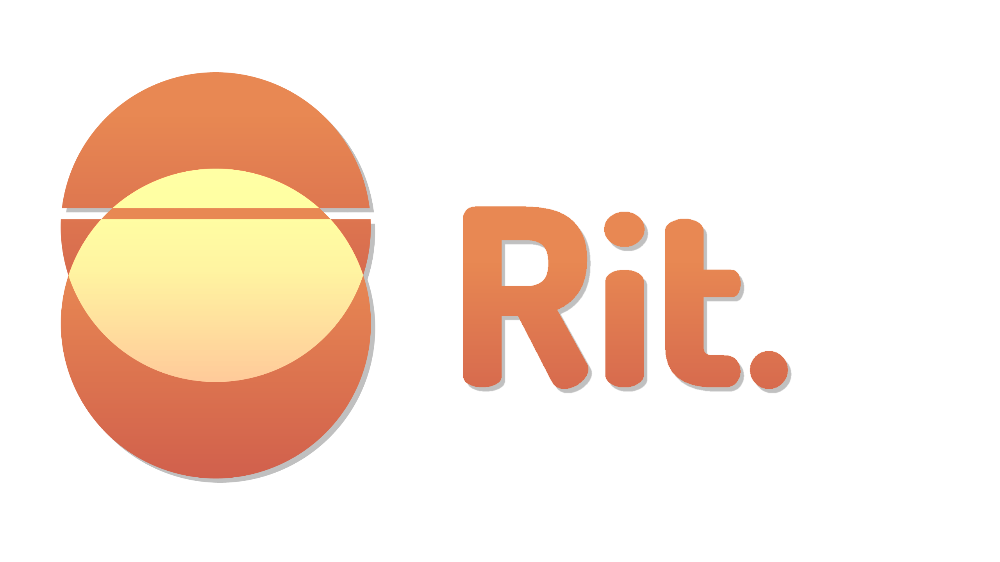
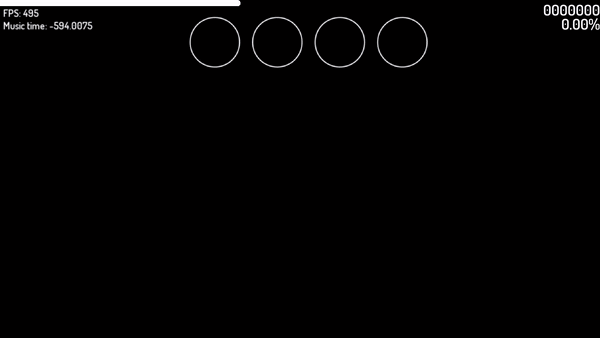

     
    <a href="https://github.com/GuglioIsStupid/Rit/blob/master/LICENSE">
    <a href="https://discord.gg/ehY5gMMPW8">
    <a href="https://github.com/GuglioIsStupid/Rit/issues">
    <a href="#"> <!--To fix our click title to relocate thing-->
    
    

    

# Rit
## A free and open source rhythm game made with LÖVE.

### How to play
Windows:
- Go to [here](https://nightly.link/GuglioIsStupid/Rit/workflows/windows-build.yaml/master) and grab archive file for your architecture (32 or 64 bits, no ARM yet)
- Extract it somewhere, like D:\Games. ***DON'T USE*** Extract Here, as it will ruin current folder.
- Launch Rit.exe
- ???
- PROFIT

Other systems:
- Download the source code from [https://github.com/GuglioIsStupid/Rit](https://github.com/GuglioIsStupid/Rit/archive/refs/heads/master.zip)
- Extract the zip file
- Run the game via dragging and dropping the folder onto the love.exe file
- Play the game!

- If you get a crash, add [discord-rpc.(dll/dylib)](https://github.com/discord/discord-rpc/releases/tag/v3.4.0) to your love installation folder.
- - Can also be found in the [resources](/resources) folder for your desired architecture.

Add songs to the %appdata%\rit\songs folder in their respective folders. (Quaver in quaver, osu in osu, etc.)
  
### How to contribute
- Fork the repository
- Make your changes
- Make a pull request
- Wait for it to be merged!

### Gameplay

### TODO
- [ ] Add a pause screen (High priority) (1/2)
- [ ] Add a settings screen (Low priority)
- [x] Save high scores (Low priority)
- [x] Controller support (Low priority)
- [ ] 5k+ support (Low priority) (1/2 (Only available for Quaver))
- [ ] More noteskins (Low priority)
- [ ] Better song selection (Low priority) (Goes with Better UI)
- [x] Downscroll support (Medium priority)

### Credits
- GuglioIsStupid - Programming
- Getsaa - Logo/Skins

### Contributors

### Notes
- This game is still in development, so ***expect*** bugs and glitches
- If you wish for your assets to be removed, please contact me via email at [guglioisbusiness@gmail.com](mailto:guglioisbusiness@gmail.com) or via discord at GuglioIsStupid#8008

### License
This project is licensed under the GNU General Public License v3.0 - see the [LICENSE](/LICENSE) file for details

### Acknowledgments
- [LÖVE](https://love2d.org/) - The game framework used
- rxi - [json.lua](/love/lib/json.lua) - The JSON library used
- Fivos Moutavelis - [ini.lua](/love/lib/ini.lua) - The ini library used
- Ulysse Ramage - [push.lua](/love/lib/push.lua) - The resolution handling library used
- Mattias Richard - [timer.lua](/love/lib/timer.lua) - The tweening library used (Apart of HUMP)
- Tesselode - [baton.lua](/love/lib/baton.lua) - The input library used

### Support the project!

### Questions?
Join the [Discord](https://discord.gg/ehY5gMMPW8)!

### Made with

### Useful links
- [Quaver](https://quavergame.com/)
- [osu!](https://osu.ppy.sh/home)

#### This project is not affiliated with [Quaver](https://quavergame.com), [osu!](https://osu.ppy.sh/home), or any other rhythm game.
